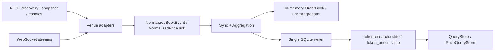

# tokenresearch

一个基于 Rust 的本地市场数据采集工具集，当前包含三个二进制：

- `tokenresearch`：订单簿采集器
- `pricecollector`：价格采集与历史回补器
- `query`：统一查询 CLI

当前接入交易所：

- Binance USD-M perpetual
- Hyperliquid perpetual
- Lighter perpetual

## 当前功能

- 统一使用 Rust 工具链实现采集、同步、存储和查询。
- 三家交易所统一走官方 REST + WebSocket 协议，不依赖官方或半官方 Rust SDK。
- 订单簿和价格系统分库落地，避免互相竞争 SQLite 写锁：
  - `tokenresearch.sqlite`
  - `token_prices.sqlite`
- Binance 订单簿使用完整本地簿同步模式：
  - `wss` 接收 diff depth 增量
  - `REST` 仅用于 discovery 和按需 snapshot 重同步
- 价格系统同时采集两种口径：
  - `trade`
  - `reference`
- 价格系统的保留策略：
  - `1s` 实时样本保留最近 `30d`
  - `1m` 历史 candle 长期保留
- 两个 runtime 都采用单连接 SQLite + 串行提交的写入模型。
- 支持 checkpoint、gap、epoch 和重启后恢复。
- 提供 Rust 查询接口和统一查询 CLI。
- 提供离线测试和 ignored 在线 smoke 测试。

## 快速开始

### 1. 运行测试

```bash
cargo test
```

订单簿在线 smoke：

```bash
cargo test --test online_smoke -- --ignored --test-threads=1 --nocapture
```

价格在线 smoke：

```bash
cargo test --test price_online_smoke -- --ignored --test-threads=1 --nocapture
```

### 2. 启动订单簿采集器

```bash
cargo run --release --bin tokenresearch -- config.toml.example
```

如果没有提供配置文件，程序会尝试读取 `config.toml`；若不存在，则退回默认配置。

### 3. 启动价格采集器

```bash
cargo run --release --bin pricecollector -- price_config.toml.example
```

如果没有提供配置文件，程序会尝试读取 `price_config.toml`；若不存在，则退回默认配置。

### 4. 默认输出

- 订单簿数据库：`tokenresearch.sqlite`
- 价格数据库：`token_prices.sqlite`
- 日志：标准输出

## 运行入口

仓库当前包含三个二进制：

- `tokenresearch`
- `pricecollector`
- `query`

`Cargo.toml` 里的默认运行入口仍然是 `tokenresearch`，所以这条命令也可用：

```bash
cargo run --release -- config.toml.example
```

## 配置项

订单簿示例配置见 [config.toml.example](/Users/welann/Documents/code/web3code/tokenresearch/config.toml.example)。

订单簿配置项：

- `database_path`
- `snapshot_every_events`
- `snapshot_every_ms`
- `max_markets_per_connection`
- `discovery_max_attempts`
- `reconnect_backoff_ms`
- `reconnect_backoff_cap_ms`

价格示例配置见 [price_config.toml.example](/Users/welann/Documents/code/web3code/tokenresearch/price_config.toml.example)。

价格配置项：

- `database_path`
- `sample_retention_days`
- `discovery_max_attempts`
- `backfill_window_days`
  - 默认 `90`
  - 表示启动时会尝试补齐“从当前时间往前 N 天”的 `1m` 历史价格
  - 设为 `0` 可关闭历史回补，只保留 live websocket 价格采集
- `http_min_interval_ms`
  - 默认 `1000`
  - 表示同一个交易所的价格 HTTP 请求最小间隔
  - 当前会作用于 discovery、重试和历史回补
- `restart_delay_ms`
- `venues`

## 查询 CLI

查询能力提供两种使用方式：

- Rust 库 API
- 独立 CLI 二进制：`query`

### 订单簿命令

`markets`，列出全部市场：

```bash
cargo run --bin query -- --db tokenresearch.sqlite markets
```

`markets`，只看某个交易所：

```bash
cargo run --bin query -- \
  --db tokenresearch.sqlite \
  markets \
  --venue hyperliquid
```

`latest`，查询最新盘口：

```bash
cargo run --bin query -- \
  --db tokenresearch.sqlite \
  latest \
  --venue hyperliquid \
  --symbol BTC \
  --depth 10
```

`latest`，查询最新盘口并输出 JSON：

```bash
cargo run --bin query -- \
  --db tokenresearch.sqlite \
  --json \
  latest \
  --venue binance \
  --symbol BTCUSDT \
  --depth 10
```

`book-at`，查询某个时间点的盘口：

```bash
cargo run --bin query -- \
  --db tokenresearch.sqlite \
  book-at \
  --venue binance \
  --symbol BTCUSDT \
  --ts-ms 1710000000000 \
  --depth 10
```

`events`，查询事件流水：

```bash
cargo run --bin query -- \
  --db tokenresearch.sqlite \
  events \
  --venue binance \
  --symbol BTCUSDT \
  --start-ms 1710000000000 \
  --end-ms 1710000600000 \
  --limit 20
```

`snapshots`，查询快照列表：

```bash
cargo run --bin query -- \
  --db tokenresearch.sqlite \
  snapshots \
  --venue lighter \
  --symbol PROVE \
  --limit 10
```

`gaps`，查询 gap：

```bash
cargo run --bin query -- \
  --db tokenresearch.sqlite \
  gaps \
  --venue binance \
  --symbol BTCUSDT
```

`health`，查询 market 健康状态：

```bash
cargo run --bin query -- \
  --db tokenresearch.sqlite \
  health \
  --venue hyperliquid \
  --symbol BTC
```

### 价格命令

价格子命令默认读取 `--price-db token_prices.sqlite`。

`price-markets`，列出价格市场：

```bash
cargo run --bin query -- \
  --price-db token_prices.sqlite \
  price-markets
```

`price-latest`，查询某个 token 的最新价格：

```bash
cargo run --bin query -- \
  --price-db token_prices.sqlite \
  --json \
  price-latest \
  --token BTC \
  --kind trade
```

`price-range`，查询某个 token 指定时间范围内的价格序列：

```bash
cargo run --bin query -- \
  --price-db token_prices.sqlite \
  --json \
  price-range \
  --token BTC \
  --kind trade \
  --start-ms 1767225600000 \
  --end-ms 1768435200000 \
  --resolution 1m
```

`price-range`，查询指定市场的高频价格：

```bash
cargo run --bin query -- \
  --price-db token_prices.sqlite \
  price-range \
  --venue binance \
  --symbol BTCUSDT \
  --kind trade \
  --start-ms 1768772400000 \
  --end-ms 1768772460000 \
  --resolution 1s
```

`price-gaps`，查询价格缺口：

```bash
cargo run --bin query -- \
  --price-db token_prices.sqlite \
  price-gaps \
  --token BTC
```

`price-health`，查询价格流健康状态：

```bash
cargo run --bin query -- \
  --price-db token_prices.sqlite \
  --json \
  price-health \
  --venue binance \
  --symbol BTCUSDT \
  --kind trade
```

## Rust API 最小示例

```rust
use tokenresearch::model::{MarketRef, Venue};
use tokenresearch::query::QueryStore;
use tokenresearch::storage::SqliteBookStore;

#[tokio::main]
async fn main() -> Result<(), Box<dyn std::error::Error + Send + Sync>> {
    let store = SqliteBookStore::connect("tokenresearch.sqlite").await?;
    let query = QueryStore::new(store);
    let market = MarketRef::new(Venue::Hyperliquid, "BTC");

    if let Some(book) = query.latest_book(&market, 10).await? {
        println!("best bid: {:?}", book.bids.first());
        println!("best ask: {:?}", book.asks.first());
    }

    Ok(())
}
```

## 设计摘要



## 目录说明

- `src/adapters`
  - 订单簿协议适配层
- `src/price_adapters`
  - 价格协议适配层
- `src/book.rs`
  - 纯内存订单簿状态机
- `src/price_runtime.rs`
  - 价格 discovery、backfill、live 聚合与写库
- `src/runtime.rs`
  - 订单簿任务编排、重试、writer 队列、live 采集流程
- `src/storage.rs`
  - 订单簿 SQLite schema 与持久化逻辑
- `src/price_storage.rs`
  - 价格 SQLite schema 与持久化逻辑
- `src/query.rs`
  - 订单簿 Rust 查询接口
- `src/price_query.rs`
  - 价格 Rust 查询接口
- `tests`
  - 单元测试、集成测试、在线 smoke
- `docs`
  - 更详细的架构、设计与运行说明

## 详细文档

- [架构与设计](/Users/welann/Documents/code/web3code/tokenresearch/docs/architecture.md)
- [运行流程与异常恢复](/Users/welann/Documents/code/web3code/tokenresearch/docs/runtime-flow.md)
- [价格采集与回补设计](/Users/welann/Documents/code/web3code/tokenresearch/docs/price-collector.md)
- [存储与查询说明](/Users/welann/Documents/code/web3code/tokenresearch/docs/storage-query.md)

## 已知限制

- Binance Futures 在某些网络出口下可能返回 `418`，这是交易所侧的访问限制，不是本地解析错误。
- 某些网络环境可能对 `wss` 握手不稳定，表现为 `tls handshake eof`。
- 当前没有内置 HTTP API。
- Binance 的完整本地订单簿仍然需要保留 REST snapshot 作为重同步锚点。
- 价格系统当前只把 `1m trade` 历史作为回补基线；`reference` 历史只在官方支持时补齐。

## 开发约束

- 测试优先，先写测试再写实现。
