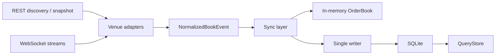

# tokenresearch

一个基于 Rust 的订单簿采集器，持续接入多个交易所的公开订单簿数据，并落地到本地 SQLite 数据库。

当前实现的接入交易所：

- Binance USD-M perpetual
- Hyperliquid perpetual
- Lighter perpetual

## 当前功能

- 统一使用 Rust 工具链实现采集、同步、存储和查询。
- 三家交易所统一走官方 REST + WebSocket 协议，不依赖官方或半官方 Rust SDK。
- Binance 使用完整本地簿同步模式：
  - `wss` 接收 diff depth 增量
  - `REST` 仅用于 market discovery 和按需 snapshot 重同步
- Hyperliquid 和 Lighter 使用 `wss` 实时更新订单簿。
- 订单簿数据落地到本地 SQLite，并启用 `WAL`。
- runtime 采用单写者写库模型，避免多 market 并发写 SQLite 导致锁竞争。
- 支持 gap 记录、epoch 切换、checkpoint 持久化和重启后恢复。
- 提供 Rust 查询接口：
  - `list_markets`
  - `latest_book`
  - `events`
  - `snapshots`
  - `gaps`
  - `collector_state`
  - `book_at`
- 提供离线测试和在线 smoke 测试。

## 快速开始

### 1. 运行测试

```bash
cargo test
```

在线 smoke 测试默认忽略，需要手动触发：

```bash
cargo test --test online_smoke -- --ignored --test-threads=1 --nocapture
```

### 2. 启动采集器

使用示例配置：

```bash
cargo run --release -- config.toml.example
```

如果没有提供配置文件，程序会尝试读取 `config.toml`；若不存在，则退回默认配置。

### 3. 默认输出

- SQLite 数据库：`tokenresearch.sqlite`
- 日志：标准输出

## 配置项

示例配置见 [config.toml.example](./config.toml.example)。

当前支持的配置项：

- `database_path`
- `snapshot_every_events`
- `snapshot_every_ms`
- `max_markets_per_connection`
- `discovery_max_attempts`
- `reconnect_backoff_ms`
- `reconnect_backoff_cap_ms`

## 查询接口

当前查询接口只提供 Rust 库 API，不提供 HTTP 服务或独立 CLI。

最小示例：

```rust
use tokenresearch::model::{MarketRef, Venue};
use tokenresearch::query::QueryStore;
use tokenresearch::storage::SqliteBookStore;

#[tokio::main]
async fn main() -> Result<(), Box<dyn std::error::Error + Send + Sync>> {
    let store = SqliteBookStore::connect("tokenresearch.sqlite").await?;
    let query = QueryStore::new(store);
    let market = MarketRef::new(Venue::Hyperliquid, "BTC");

    if let Some(book) = query.latest_book(&market, 10).await? {
        println!("best bid: {:?}", book.bids.first());
        println!("best ask: {:?}", book.asks.first());
    }

    Ok(())
}
```

## 设计摘要



## 目录说明

- `src/adapters`
  - 三家交易所的协议适配层
- `src/book.rs`
  - 纯内存订单簿状态机
- `src/sync.rs`
  - Binance 与通用交易所的同步逻辑
- `src/runtime.rs`
  - 任务编排、重试、writer 队列、live 采集流程
- `src/storage.rs`
  - SQLite schema 与持久化逻辑
- `src/query.rs`
  - Rust 查询接口
- `tests`
  - 单元测试、集成测试、在线 smoke
- `docs`
  - 更详细的架构、设计与运行说明

## 详细文档

- [架构与设计](./docs/architecture.md)
- [运行流程与异常恢复](./docs/runtime-flow.md)
- [存储与查询说明](./docs/storage-query.md)

## 已知限制

- Binance Futures 在某些网络出口下可能返回 `418`，这是交易所侧的访问限制，不是本地解析错误。
- 某些网络环境可能对 `wss` 握手不稳定，表现为 `tls handshake eof`。
- 当前没有内置 HTTP API 或查询 CLI，查询主要通过 Rust API 使用。
- Binance 的完整本地订单簿仍然需要按官方要求保留 REST snapshot 作为重同步锚点，不能纯靠 `wss` 实现完整簿。

## 开发约束

- 测试优先，先写测试再写实现。
- 核心同步逻辑与状态机尽量保持纯逻辑，副作用集中在 runtime / storage。
- 每个主要功能改动单独提交 git。
