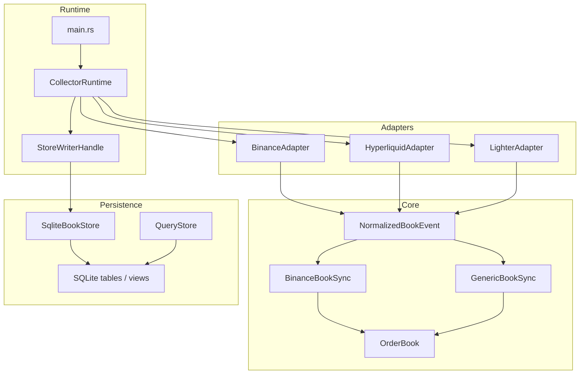

# 架构与设计

本文描述当前实现的模块边界、设计取舍和核心数据流。

## 设计目标

- 持续接收多交易所订单簿数据。
- 统一标准化不同交易所的原始 payload。
- 对 Binance 保持正确的完整本地簿同步。
- 将实时状态和历史事件同时落地到 SQLite。
- 在网络波动、连接断开、程序重启后保持可恢复和可审计。

## 模块划分

## 设计思路

### 1. 协议适配与业务逻辑分离

`src/adapters` 只负责做一件事：把交易所原始 REST / WebSocket 响应转成统一的 `NormalizedMarket` 和 `NormalizedBookEvent`。

这样做的原因：

- 各交易所字段命名和 channel 结构不同。
- 订单簿同步逻辑不应该依赖原始协议细节。
- 可以用固定 JSON 夹具对适配器做单独测试。

### 2. 状态机与副作用分离

`src/book.rs` 中的 `OrderBook` 是纯内存状态机，不做网络请求、不做数据库写入。

同步层负责把标准事件变成“状态变化 + 持久化结果”：

- `BinanceBookSync`
  - 处理 snapshot + buffered delta + sequence 校验
- `GenericBookSync`
  - 处理 image / delta / heartbeat 的通用更新流程

这样做的原因：

- 状态机更容易单测
- 同步逻辑更容易验证 gap / resync
- runtime 只负责调度，不负责核心序列正确性

### 3. 单写者落库

SQLite 适合单写者，不适合很多异步任务同时抢写锁。

当前 runtime 的写入策略：

- 各 market task 并发采集
- 所有 `open_epoch` / `close_epoch` / `commit_batch` 都进入单一 writer 队列
- writer 串行调用 `SqliteBookStore`

这样做的原因：

- 减少 `database is locked`
- 减少慢 SQL 告警
- 保证写入顺序更清晰

## Binance 的设计取舍

Binance 这里没有改成纯 `wss`。

原因是当前目标是“完整本地簿”，这要求遵循官方流程：

1. 建立 `diff depth` websocket
2. 缓冲增量
3. 请求一次 REST snapshot
4. 用 `lastUpdateId` 和 diff 序列拼接
5. 断档时重新请求 snapshot

当前实现又额外做了收敛：

- market discovery 优先读取本地缓存的 `markets`
- snapshot 改成按需请求，不再在批次启动时对全部 market 并发打 REST
- snapshot 失败按 market 单独退避，避免反复轰炸 Binance REST

## 数据模型

### 标准市场模型

`NormalizedMarket` 统一表达：

- `market`
- `venue_market_id`
- `base_asset`
- `quote_asset`
- `market_type`
- `status`
- `price_decimals`
- `size_decimals`

### 标准事件模型

`NormalizedBookEvent` 统一表达：

- `market`
- `kind`
- `exchange_ts_ms`
- `received_ts_ms`
- `sequence`
- `bids`
- `asks`
- `raw_payload`

### 事件种类

- `Snapshot`
- `Delta`
- `Image`
- `Gap`
- `Heartbeat`

## 可恢复性设计

### checkpoint

每个 market 都会维护 checkpoint，用于记录：

- 当前 epoch
- 最近 sequence
- 最近 exchange timestamp
- 最近状态

### gap

当序列不连续、连接断开、无法桥接 snapshot / delta 时，会写入 `gap_windows`。

这意味着系统不会假装历史连续；缺口是显式可查询的。

### epoch

每个 market 的连续同步阶段对应一个 `stream_epoch`：

- 启动时创建 epoch
- 重连或重同步时关闭旧 epoch，开启新 epoch

## 当前边界

- 查询层是 Rust API，不是 HTTP 服务
- 当前没有 built-in CLI 查询命令
- 当前聚焦公开市场数据，不处理下单、账户、私有流
