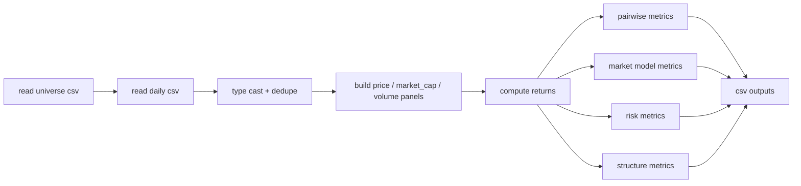

# CoinGecko CSV 指标计算实现计划

本文说明后续将如何基于现有 CoinGecko CSV 数据，使用 `uv` 工具链编写一套可重复运行的指标计算脚本。

当前已经存在的输入数据位于：

- `coingeko/coingecko_out/universe_top300_usd_days365.csv`
- `coingeko/coingecko_out/market_chart_daily_top300_usd_days365.csv`
- `coingeko/coingecko_out/market_chart_points_top300_usd_days365.csv`

其中本次指标计算将**以日频文件为主**，原始点位文件先保留，暂时不作为主输入。

## 目标

基于“当前总市值前 300 名”的币种集合，构建一套日频研究流水线，覆盖以下四类指标：

1. 两两关系
   - Pearson correlation
   - Rolling correlation
   - DCC-GARCH
   - Cointegration
2. 领先/滞后
   - Cross-correlation function
   - Granger causality
3. 市场暴露 / 特质性
   - Beta
   - `R²`
   - Idiosyncratic volatility
4. 稳定性 / 结构
   - Realized volatility
   - Downside semivariance
   - Maximum drawdown
   - PCA
   - Hierarchical clustering
   - Centrality

## 使用 `uv` 的方式

后续 Python 代码将放在 `coingeko/` 目录内，统一使用 `uv` 管理依赖与运行。

### 依赖规划

基础依赖会扩展为：

```toml
pandas
numpy
scipy
statsmodels
scikit-learn
networkx
arch
pyarrow
```

安装方式：

```bash
cd coingeko
uv add pandas numpy scipy statsmodels scikit-learn networkx arch pyarrow
```

说明：

- `pandas` / `numpy`：数据清洗、收益率、滚动窗口
- `scipy`：层次聚类、统计工具
- `statsmodels`：协整、Granger、OLS
- `scikit-learn`：PCA
- `networkx`：中心性
- `arch`：单变量 GARCH；DCC 部分将采用“两步法”自己封装
- `pyarrow`：后续如果要把中间结果落成 parquet，会比较方便

## 输入数据定义

### `universe_top300_usd_days365.csv`

它是一次 Top300 快照，后续主要用于：

- 确定样本池
- 使用 `market_cap_rank` 排序
- 读取 `coin_id` / `coin_symbol` / `name`
- 保留后续展示时需要的静态元数据

### `market_chart_daily_top300_usd_days365.csv`

这个文件是本次主输入。关键字段如下：

| 字段 | 作用 |
| --- | --- |
| `coin_id` | 主键的一部分，唯一标识币种 |
| `coin_symbol` | 展示/宽表列名候选 |
| `coin_name` | 展示名称 |
| `market_cap_rank` | 当前排名 |
| `date_utc` | 日频日期 |
| `price` | 日价格序列主字段 |
| `market_cap` | 日市值序列 |
| `total_volume` | 日成交量序列 |
| `last_ts_ms` / `last_datetime_utc` | 数据时间戳审计字段 |
| `points_in_day` | 当天原始点数，用于质量检查 |

## 总体处理流程



## 数据预处理设计

### 1. 读取与类型转换

读取时统一做以下处理：

- `date_utc` 转为 `datetime64[ns, UTC]`
- `price` / `market_cap` / `total_volume` 转为浮点
- `market_cap_rank` 转为整数
- 按 `coin_id + date_utc` 去重，保留 `last_ts_ms` 最大的一条

### 2. 样本过滤

默认只保留：

- `universe` 中存在的 Top300 币种
- `price > 0`
- 同一币种至少有 `min_history_days` 个有效观测，默认 `90`

注意：

- 新币 TGE 前没有数据，就保持缺失，不做前向填充
- 对齐两只币时只使用**重叠样本区间**

### 3. 构建面板

会先从长表转成几个宽表：

- `price_wide[date, coin_id]`
- `market_cap_wide[date, coin_id]`
- `volume_wide[date, coin_id]`

然后基于 `price_wide` 计算：

- 简单收益率：`r_t = P_t / P_{t-1} - 1`
- 对数收益率：`log_r_t = log(P_t) - log(P_{t-1})`

默认约定：

- **相关性、CCF、Granger、Beta、PCA、波动率** 用**对数收益率**
- **协整、最大回撤** 用**价格水平**或 `log(price)`

## 输出目录规划

统一输出到：

- `coingeko/analysis_out/`

建议按模块分文件：

| 文件 | 内容 |
| --- | --- |
| `prepared_prices.csv` | 清洗后的长表 |
| `returns_wide.csv` | 日收益率宽表 |
| `pairwise_correlation.csv` | 全样本 Pearson 相关系数 |
| `rolling_correlation.csv` | 滚动相关长表 |
| `dcc_garch.csv` | DCC 动态相关 |
| `cointegration.csv` | 协整检验结果 |
| `ccf.csv` | 不同 lag 的交叉相关 |
| `granger.csv` | Granger 因果检验统计量 |
| `market_exposure.csv` | beta / R² / residual vol |
| `risk_metrics.csv` | realized vol / semivariance / MDD |
| `pca_summary.csv` | PCA explained variance |
| `pca_loadings.csv` | PCA loadings |
| `clustering_linkage.csv` | 层次聚类 linkage 结果 |
| `centrality.csv` | 网络中心性 |

## 指标实现方案

## 1. 收益率相关系数（Pearson correlation）

### 输入

- `returns_wide`
- 默认使用对数收益率

### 实现

对每一对币 `(i, j)`：

- 取二者重叠日期
- 若样本数 `< min_overlap_days`，则不计算
- 用 `Series.corr(method="pearson")`

### 输出字段

| 字段 | 含义 |
| --- | --- |
| `coin_id_x` | 币 A |
| `coin_id_y` | 币 B |
| `n_obs` | 重叠样本数 |
| `pearson_corr` | Pearson 相关系数 |

### 备注

这是 pairwise 全样本基线指标，后续很多模块会先用它筛候选对。

## 2. 滚动相关（Rolling correlation）

### 输入

- `returns_wide`
- 默认窗口：`30` / `60` / `90` 天

### 实现

对每个币对：

- 对齐重叠收益率
- 使用 `rolling(window).corr()`
- 结果展开成长表

### 输出字段

| 字段 | 含义 |
| --- | --- |
| `date_utc` | 窗口结束日 |
| `coin_id_x` / `coin_id_y` | 币对 |
| `window` | 滚动窗口长度 |
| `rolling_corr` | 滚动相关值 |

## 3. DCC-GARCH

### 输入

- 两只币的对数收益率序列

### 实现策略

DCC-GARCH 不会直接依赖冷门第三方库，而是采用更稳的二阶段方法：

1. 对每只币分别拟合 `GARCH(1,1)`：
   - 使用 `arch` 包
   - 得到条件波动率 `sigma_t`
2. 标准化残差：
   - `z_t = epsilon_t / sigma_t`
3. 在标准化残差上估计 DCC 参数：
   - 用 `Q_t = (1-a-b)Qbar + a z_{t-1}z'_{t-1} + b Q_{t-1}`
   - 再标准化成 `R_t`
4. 提取每日动态相关系数

### 计算范围控制

由于 Top300 全对组合是 `300 * 299 / 2 = 44,850` 对，DCC 全量跑会非常慢，因此默认策略是：

- 先用全样本相关和样本覆盖率筛选候选对
- 默认只对候选对跑 DCC
- 候选条件示例：
  - `abs(pearson_corr) >= 0.5`
  - `n_obs >= 180`

### 输出字段

| 字段 | 含义 |
| --- | --- |
| `date_utc` | 日期 |
| `coin_id_x` / `coin_id_y` | 币对 |
| `dcc_corr` | DCC 动态相关 |
| `n_obs` | 输入样本长度 |
| `garch_spec` | 模型规格 |

## 4. 协整（Cointegration）

### 输入

- 两只币的价格水平序列
- 默认使用 `log(price)`

### 实现

- 对齐价格序列
- 要求 `n_obs >= 180`
- 使用 `statsmodels.tsa.stattools.coint`
- 保留 test statistic、p-value、critical values

### 输出字段

| 字段 | 含义 |
| --- | --- |
| `coin_id_x` / `coin_id_y` | 币对 |
| `n_obs` | 样本长度 |
| `coint_t` | 检验统计量 |
| `pvalue` | p 值 |
| `crit_1pct` / `crit_5pct` / `crit_10pct` | 临界值 |
| `is_cointegrated_5pct` | 是否在 5% 水平拒绝原假设 |

### 备注

协整和普通相关不同，它更适合找“长期绑定”的币对。这里不在 TGE 前补值，因此重叠区会自动截短。

## 5. 交叉相关函数（CCF）

### 输入

- 两只币的对数收益率序列

### 实现

- 对齐后去均值
- 对一组 lag 计算 `corr(r_x[t-k], r_y[t])`
- 默认 `lag_range = [-14, 14]`
- 使用手写 lag 循环或 `statsmodels` 工具函数

### 输出字段

| 字段 | 含义 |
| --- | --- |
| `coin_id_x` / `coin_id_y` | 币对 |
| `lag` | 滞后阶数 |
| `ccf_value` | 对应 lag 下的相关 |
| `n_obs` | 有效样本数 |

### 备注

它主要作为 lead-lag 候选筛选器，不直接当作“因果结论”。

## 6. Granger 因果检验（Granger causality）

### 输入

- 两只币的对数收益率序列

### 实现

- 对齐收益率
- 使用 `statsmodels.tsa.stattools.grangercausalitytests`
- 默认 `max_lag = 7`
- 对每个方向都测：
  - `x -> y`
  - `y -> x`
- 可按 AIC/BIC 或最小 p 值挑一个代表滞后阶

### 输出字段

| 字段 | 含义 |
| --- | --- |
| `source_coin_id` | 领先候选 |
| `target_coin_id` | 被预测对象 |
| `lag` | 滞后阶 |
| `test_name` | 如 `ssr_ftest` |
| `statistic` | 检验统计量 |
| `pvalue` | p 值 |
| `n_obs` | 样本长度 |

## 7. Beta（市场 beta）

### 市场因子定义

默认使用**Top300 自建市值加权市场收益率**：

- 每天根据前一日 `market_cap` 计算权重
- 对当日币种收益做加权平均
- 得到 `market_return_t`

同时保留替代选项：

- `btc`
- `eth`
- 等权指数

### 实现

对每个币做 OLS：

`coin_return_t = alpha + beta * market_return_t + epsilon_t`

使用 `statsmodels.api.OLS`。

### 输出字段

| 字段 | 含义 |
| --- | --- |
| `coin_id` | 币种 |
| `beta` | 市场 beta |
| `alpha` | 截距 |
| `n_obs` | 样本数 |
| `market_proxy` | 使用的市场代理 |

## 8. 决定系数 `R²`

### 实现

沿用 beta 同一条回归。

### 输出字段

| 字段 | 含义 |
| --- | --- |
| `coin_id` | 币种 |
| `r_squared` | 模型解释度 |
| `adj_r_squared` | 调整后 `R²` |
| `market_proxy` | 市场代理 |

### 备注

这里的 `R²` 直接反映“该币有多少波动是市场驱动的”。

## 9. 特质波动率 / 残差波动率

### 实现

沿用 market model 残差：

- `epsilon_t = coin_return_t - alpha - beta * market_return_t`
- 取残差标准差
- 可年化：`std(epsilon) * sqrt(365)`

### 输出字段

| 字段 | 含义 |
| --- | --- |
| `coin_id` | 币种 |
| `residual_vol` | 残差波动率 |
| `residual_vol_annualized` | 年化残差波动率 |
| `market_proxy` | 市场代理 |

## 10. 已实现波动率（Realized volatility）

### 重要说明

当前主输入是**日频 CSV**，因此这里实现的是：

- 基于**日收益率**的 rolling realized volatility

而不是基于更高频数据求和的真正 intraday RV。

### 实现

- `rv_window = sqrt(sum(log_r_t^2 over window))`
- 默认窗口：`7` / `30` / `90` 天

### 输出字段

| 字段 | 含义 |
| --- | --- |
| `coin_id` | 币种 |
| `date_utc` | 窗口结束日 |
| `window` | 窗口长度 |
| `realized_vol` | 已实现波动率 |

## 11. 下行半方差 / 下行半波动

### 实现

基于对数收益率：

- 只保留 `< 0` 的收益
- `downside_semivariance = mean(min(r_t, 0)^2)`
- `downside_semivol = sqrt(downside_semivariance)`
- 默认做滚动窗口版本

### 输出字段

| 字段 | 含义 |
| --- | --- |
| `coin_id` | 币种 |
| `date_utc` | 日期 |
| `window` | 窗口 |
| `downside_semivariance` | 下行半方差 |
| `downside_semivol` | 下行半波动 |

## 12. 最大回撤（MDD）

### 实现

基于价格序列：

- `running_peak_t = cummax(price_t)`
- `drawdown_t = price_t / running_peak_t - 1`
- `mdd = drawdown_t.min()`

同时可以输出每日 drawdown 路径。

### 输出字段

| 字段 | 含义 |
| --- | --- |
| `coin_id` | 币种 |
| `mdd` | 样本期最大回撤 |
| `mdd_start_date` | 峰值日期 |
| `mdd_trough_date` | 谷值日期 |
| `latest_drawdown` | 最新回撤 |

## 13. PCA

### 输入

- 币种日收益率矩阵

### 实现

- 先在日期维度对齐
- 对每列标准化
- 缺失值处理：
  - 默认先按最小覆盖率筛币
  - 再对剩余矩阵用“共同样本区间”
- 使用 `sklearn.decomposition.PCA`

### 输出字段

#### `pca_summary.csv`

| 字段 | 含义 |
| --- | --- |
| `component` | 主成分编号 |
| `explained_variance` | 解释方差 |
| `explained_variance_ratio` | 解释方差占比 |
| `cumulative_ratio` | 累计解释占比 |

#### `pca_loadings.csv`

| 字段 | 含义 |
| --- | --- |
| `coin_id` | 币种 |
| `component` | 主成分编号 |
| `loading` | 载荷 |

## 14. 层次聚类（Hierarchical clustering）

### 输入

- 币种间相关矩阵

### 实现

默认距离定义：

- `distance(i, j) = sqrt(0.5 * (1 - corr(i, j)))`

然后：

- 使用 `scipy.cluster.hierarchy.linkage`
- 默认 `method = "average"`
- 生成 linkage matrix

### 输出字段

| 字段 | 含义 |
| --- | --- |
| `cluster_step` | 合并步骤 |
| `left` / `right` | 被合并的簇/节点 |
| `distance` | 本次合并距离 |
| `cluster_size` | 新簇大小 |

## 15. 中心性（Centrality）

### 图构建方式

先把币之间的关系转成图：

- 节点：币种
- 边：满足某种显著关系的币对

默认边规则先用最稳的一版：

- `abs(pearson_corr) >= threshold`
- `n_obs >= min_overlap_days`

后续可增加：

- cointegration 边
- Granger lead-lag 边

### 实现

使用 `networkx`：

- `degree_centrality`
- 可选扩展：`betweenness_centrality`、`eigenvector_centrality`

### 输出字段

| 字段 | 含义 |
| --- | --- |
| `coin_id` | 币种 |
| `degree_centrality` | 度中心性 |
| `betweenness_centrality` | 中介中心性（可选） |
| `eigenvector_centrality` | 特征向量中心性（可选） |
| `graph_type` | 使用了哪种建图规则 |

## 模块拆分计划

为了让代码更容易维护，后续会拆成以下模块：

| 文件 | 责任 |
| --- | --- |
| `coingeko/metrics/io.py` | 读取 CSV、类型转换、去重 |
| `coingeko/metrics/panel.py` | 宽表构建、收益率构造、市场指数构造 |
| `coingeko/metrics/pairwise.py` | correlation / rolling corr / cointegration |
| `coingeko/metrics/leadlag.py` | CCF / Granger |
| `coingeko/metrics/dcc.py` | GARCH + DCC 两步法 |
| `coingeko/metrics/market_model.py` | beta / R² / residual volatility |
| `coingeko/metrics/risk.py` | realized vol / semivariance / MDD |
| `coingeko/metrics/structure.py` | PCA / clustering / centrality |
| `coingeko/metrics/cli.py` | 命令行入口 |

## CLI 设计草案

统一从 `uv run` 调用：

```bash
cd coingeko
uv run python -m metrics.cli prepare \
  --universe-csv coingecko_out/universe_top300_usd_days365.csv \
  --daily-csv coingecko_out/market_chart_daily_top300_usd_days365.csv \
  --out-dir analysis_out
```

后续每类指标单独一个子命令：

```bash
uv run python -m metrics.cli correlation --out-dir analysis_out
uv run python -m metrics.cli cointegration --out-dir analysis_out
uv run python -m metrics.cli granger --out-dir analysis_out --max-lag 7
uv run python -m metrics.cli market-model --out-dir analysis_out --market-proxy cap_weighted
uv run python -m metrics.cli risk --out-dir analysis_out
uv run python -m metrics.cli structure --out-dir analysis_out
uv run python -m metrics.cli dcc --out-dir analysis_out
```

## 计算顺序建议

按稳定性和性价比，建议分三层实现：

### 第一层：先落地

- prepare
- Pearson correlation
- Rolling correlation
- Cointegration
- Beta / `R²` / residual volatility
- Realized volatility
- Downside semivariance
- Maximum drawdown
- PCA
- Hierarchical clustering
- Centrality

这些都比较稳定，依赖成熟，适合先跑完整个 Top300。

### 第二层：再做 lead-lag

- CCF
- Granger causality

因为 pairwise 计算量大，建议先对相关性较高或同板块候选对子集计算。

### 第三层：最后做 DCC-GARCH

- 先筛候选对
- 再跑 DCC

原因是 DCC 在 Top300 全量 pair 上开销最大，不适合一开始就全量硬算。

## 已知限制

### 1. 当前是“当前 Top300”的回看

这会天然带来 survivorship bias。

### 2. 当前主输入是日频

所以：

- realized volatility 只能做“基于日收益率的近似版”
- 不能从这份数据里恢复真正的高频 RV

### 3. 新币历史较短

很多 pair 会因为重叠区不够长而无法做：

- 协整
- Granger
- DCC

因此所有 pairwise 模块都要带 `min_overlap_days` 过滤。

## 默认配置建议

| 参数 | 默认值 | 说明 |
| --- | --- | --- |
| `min_history_days` | `90` | 单币至少保留 90 天历史 |
| `min_overlap_days` | `90` | 币对至少 90 天重叠 |
| `rolling_windows` | `30, 60, 90` | 滚动指标默认窗口 |
| `granger_max_lag` | `7` | 日频 Granger 默认最大滞后 |
| `ccf_max_lag` | `14` | CCF 默认前后各 14 天 |
| `corr_threshold` | `0.6` | 中心性建图默认阈值 |
| `market_proxy` | `cap_weighted` | 默认市场代理 |

## 小结

后续实现会遵循这几个原则：

- 用 `uv` 统一依赖和运行
- 直接读取你已经准备好的 CSV，不重新抓数
- 先把日频面板清洗稳定，再分模块计算指标
- 对重型指标（Granger / DCC）先筛候选，避免无意义全量爆算
- 所有结果都落成 CSV，方便你后面继续分析或接数据库
