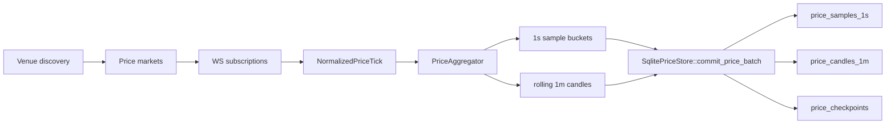
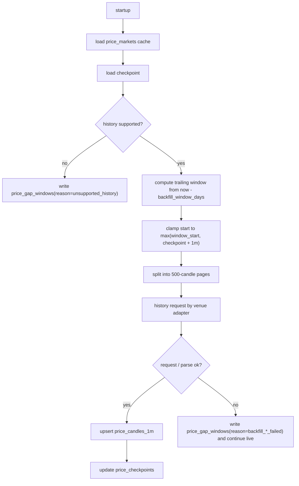
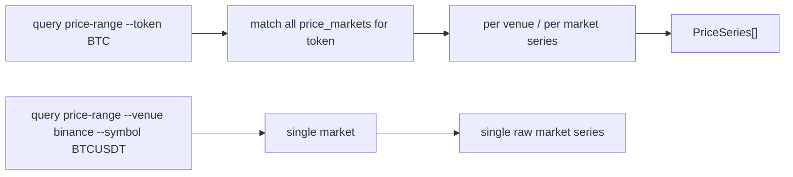

# 价格采集与回补设计

本文描述第三个模块 `pricecollector` 的结构、数据流、回补逻辑和查询语义。

## 目标

- 独立采集三家交易所永续市场价格
- 使用独立数据库 `token_prices.sqlite`
- 支持 `trade` 与 `reference` 两种价格口径
- 支持 `1s` 实时样本和 `1m` 历史 candle
- 支持重启后自动回补 `1m trade`
- 明确记录不可补的 `reference` 历史缺口

## 模块划分

- `src/price_model.rs`
  - 公共类型、查询请求、采样和 candle 结构
- `src/price_adapters/*`
  - Binance / Hyperliquid / Lighter 的价格发现、live tick、历史 candle 解析
- `src/price_storage.rs`
  - 价格数据库 schema、事务写入、checkpoint、gap
- `src/price_query.rs`
  - 价格查询 API
- `src/price_runtime.rs`
  - 市场发现、历史回补、live tick 聚合、写库编排
- `src/bin/pricecollector.rs`
  - 价格采集器入口

## live 数据流

## 回补与缺口修复

## 查询视角

## 查询语义

- `resolution=auto`
  - 如果整个窗口都在 `1s` 保留期内，且没有命中 `1s` gap，则返回 `1s`
  - 否则回退到 `1m`
- `resolution=1s`
  - 超出 `30d` 保留期，或命中 `1s` gap，直接报错
- token 查询
  - 返回每个 venue 一条独立序列
  - 不做跨 venue 平均价
- venue + symbol 查询
  - 返回单一原始市场序列

## 当前已知边界

- 当前 `pricecollector` 采用 cycle + reconnect 方式，live websocket 断开后重新进入 discovery/backfill/live 周期
- 每个 venue 会先建立 live websocket，再在后台按限速慢慢执行 backfill
- 当前 `reference` 历史只对 Binance 做官方回补
- 当前 `1s` 样本是最近窗口的高频查询层，不是长期归档层
- 历史回补窗口默认是“当前时间往前 90 天”，通过 `backfill_window_days` 配置
- 同一个 venue 的价格 HTTP 请求默认按 `http_min_interval_ms = 1000` 节流，避免 backfill / discovery 触发限流
