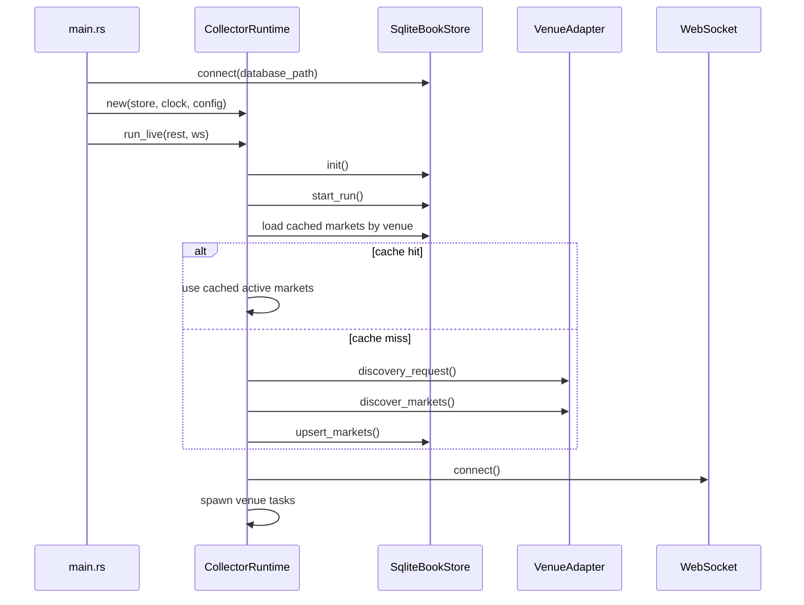
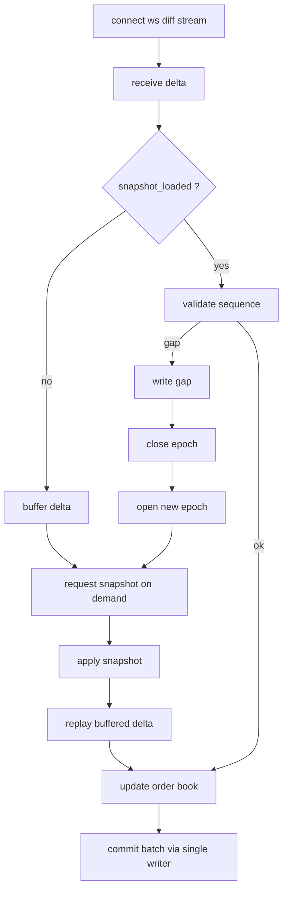
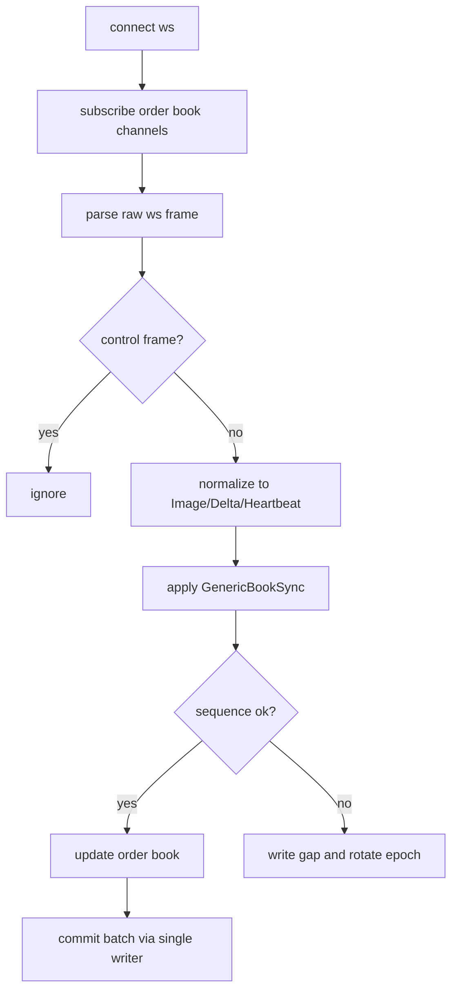

# 运行流程与异常恢复

本文描述程序启动后如何运行，以及在断线、重连和序列异常时如何恢复。

## 启动流程

## 运行时任务模型

运行时主要有三类任务：

- market discovery / bootstrap
- venue websocket reader
- store writer

### 1. discovery

每个 venue 启动时都会先尝试获取 market 列表：

- 优先从本地 SQLite 读取缓存的 `markets`
- 如果没有缓存，再走远端 discovery
- discovery 失败时按指数退避重试，直到超过 `discovery_max_attempts`

### 2. venue reader

每个交易所按 market 批次创建 websocket 任务：

- Binance 使用专门的 `run_binance_batch`
- Hyperliquid / Lighter 使用 `run_generic_batch`

### 3. single writer

所有写库操作统一进入 writer 队列：

- `open_epoch`
- `close_epoch`
- `commit_batch`

## Binance 运行逻辑

### 关键点

- websocket diff 是实时主链路
- snapshot 不是预先全量拉，而是按 market 按需拉取
- snapshot 失败会对单 market 退避，不会每条 diff 都重复打 REST
- 发现 sequence 断档时：
  - 写入 gap
  - 切换 epoch
  - 重新等待 snapshot 重建

## Hyperliquid / Lighter 运行逻辑

### 解析器稳固化

当前实现已经对一些 live 常见噪声帧做了忽略：

- Hyperliquid：
  - `subscriptionResponse`
  - `pong`
  - 非 `l2Book` channel
- Lighter：
  - `connected`
  - `subscribed`
  - `pong`
  - 只包含 `channel` 的订单簿标识消息
  - `market_id` / `marketId` / `subscription.channel` 等字段变体

## commit_batch 的内容

每次提交可能包含以下任意组合：

- `events`
- `latest_book`
- `snapshot`
- `checkpoint`
- `gaps`

这让 storage 能在一个统一入口里原子更新：

- 事件日志
- 最新盘口物化表
- 快照
- checkpoint
- 缺口记录

## 重连逻辑

### websocket 连接失败

- 记录 warning
- 按 `reconnect_backoff_ms` 指数退避
- 达到上限后维持 `reconnect_backoff_cap_ms`

### websocket 读流中断

读流中断后会：

1. 为所有受影响 market 写入 gap
2. 关闭旧 epoch
3. 打开新 epoch
4. 重置本地同步状态
5. 重新连接 websocket

## 程序重启后的行为

当前设计允许重启后恢复以下内容：

- 已采集的 market 元数据
- 已写入的历史订单簿事件
- 最新盘口物化状态
- 快照
- gap 记录

当前实现会优先复用本地 `markets` 缓存，所以在像 Binance 这类对 REST 更敏感的环境下，重启后不会总是先因为 discovery 被卡住。

## 当前网络现实约束

这部分不是代码 bug，而是运行环境约束：

- Binance Futures 可能对某些出口返回 `418`
- 某些网络环境会在 `wss` TLS 握手阶段直接断开，表现为 `tls handshake eof`

这类问题的修复方向不是继续改状态机，而是：

- 代理支持
- 按交易所启停
- 更温和的连接节奏
