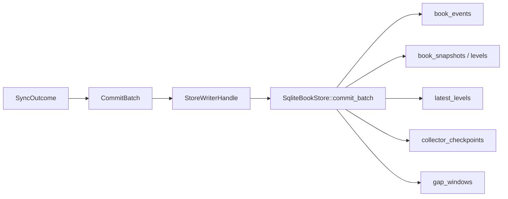
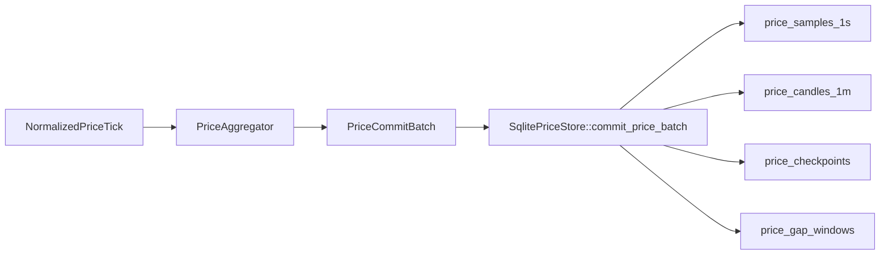
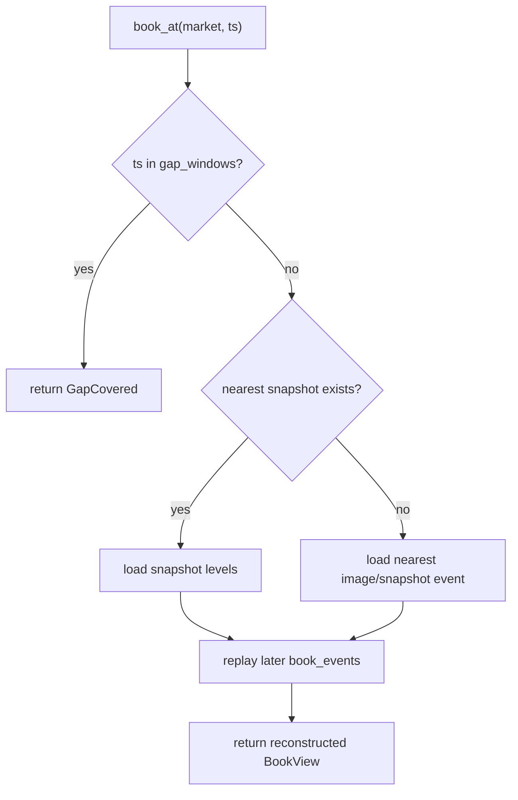

# 存储与查询说明

本文描述两套 SQLite schema、物化策略以及当前的 Rust 查询接口与 CLI。

## 订单簿存储结构

订单簿数据库 schema 由 `src/storage.rs` 初始化。

### 元数据与运行状态

- `markets`
- `collector_runs`
- `stream_epochs`

### 订单簿主数据

- `book_events`
- `book_snapshots`
- `book_snapshot_levels`
- `latest_levels`

### 完整性与恢复

- `collector_checkpoints`
- `gap_windows`

### 只读视图

- `v_latest_best_quote`
- `v_market_health`
- `v_gap_summary`

## 订单簿写入策略



### 为什么同时保留事件和物化状态

只存 latest book 不够：

- 无法回放历史
- 无法审计 gap
- 无法做 `book_at`

只存事件也不够：

- 读取最新盘口会很慢
- 每次都要从头重放

因此订单簿系统采用双层存储：

- 事件日志用于审计和历史重建
- `latest_levels` 用于快速查询当前簿
- 快照用于降低历史回放成本

## 价格存储结构

价格数据库 schema 由 `src/price_storage.rs` 初始化，默认文件是 `token_prices.sqlite`。

### 元数据与运行状态

- `price_markets`
- `price_runs`
- `price_stream_epochs`

### 价格主数据

- `price_samples_1s`
  - 最近 30 天的实时样本
- `price_candles_1m`
  - 长期保存的 1m OHLCV

### 完整性与恢复

- `price_checkpoints`
- `price_gap_windows`

### 价格视图

- `v_price_latest`
- `v_price_health`
- `v_price_gap_summary`

## 价格写入策略



## 查询接口

### 订单簿查询

`src/query.rs` 提供：

- `list_markets(venue)`
- `latest_book(market, depth)`
- `events(market, range, limit)`
- `snapshots(market, range, limit)`
- `gaps(market, range)`
- `collector_state(market)`
- `book_at(market, ts_ms, depth)`

### 价格查询

`src/price_query.rs` 提供：

- `list_price_markets(venue)`
- `latest_price(token, kind, venue, market_symbol)`
- `price_range(request)`
- `price_gaps(token, venue, range)`
- `price_health(venue, market_symbol, kind)`

## 查询 CLI

统一查询二进制：

- `cargo run --bin query -- ...`

### 订单簿子命令

- `markets`
- `latest`
- `book-at`
- `events`
- `snapshots`
- `gaps`
- `health`

### 价格子命令

- `price-markets`
- `price-latest`
- `price-range`
- `price-gaps`
- `price-health`

### 全局参数

- 订单簿库：`--db <sqlite_path>`，默认 `tokenresearch.sqlite`
- 价格库：`--price-db <sqlite_path>`，默认 `token_prices.sqlite`
- 输出 JSON：`--json`

## CLI 示例

`markets`，列出全部订单簿市场：

```bash
cargo run --bin query -- --db tokenresearch.sqlite markets
```

`latest`，查询最新盘口：

```bash
cargo run --bin query -- \
  --db tokenresearch.sqlite \
  --json \
  latest \
  --venue lighter \
  --symbol PROVE \
  --depth 5
```

`book-at`，查询某个时间点的盘口：

```bash
cargo run --bin query -- \
  --db tokenresearch.sqlite \
  book-at \
  --venue binance \
  --symbol BTCUSDT \
  --ts-ms 1710000000000 \
  --depth 10
```

`price-markets`，列出价格市场：

```bash
cargo run --bin query -- \
  --price-db token_prices.sqlite \
  price-markets
```

`price-latest`，查看最新价格：

```bash
cargo run --bin query -- \
  --price-db token_prices.sqlite \
  --json \
  price-latest \
  --token BTC \
  --kind trade
```

`price-range`，查询指定时间范围：

```bash
cargo run --bin query -- \
  --price-db token_prices.sqlite \
  --json \
  price-range \
  --token BTC \
  --kind trade \
  --start-ms 1767225600000 \
  --end-ms 1768435200000 \
  --resolution 1m
```

`price-gaps`，查询价格缺口：

```bash
cargo run --bin query -- \
  --price-db token_prices.sqlite \
  price-gaps \
  --token BTC
```

`price-health`，查询价格流健康状态：

```bash
cargo run --bin query -- \
  --price-db token_prices.sqlite \
  --json \
  price-health \
  --venue binance \
  --symbol BTCUSDT \
  --kind trade
```

## `book_at` 的语义

`book_at` 的实现逻辑：

1. 先检查请求时间是否命中 `gap_windows`
2. 如果命中 gap，直接返回 `GapCovered`
3. 如果有早于该时刻的 snapshot，则从最近 snapshot 重建
4. 否则从最近的 `image` / `snapshot` 事件作为锚点
5. 重放锚点之后直到目标时刻之前的事件



## `price_range` 的语义

- `resolution=auto`
  - 如果窗口完整落在 `1s` 保留期内，并且没有命中 `1s` gap，则返回 `1s`
  - 否则回退到 `1m`
- `resolution=1s`
  - 超出 `30d` 保留期或命中 gap，直接返回错误
- `token` 查询
  - 返回每个 venue 的独立 `PriceSeries`
- `venue + symbol` 查询
  - 返回单个市场的原始序列

## 精度与数值存储

为了避免浮点误差：

- Rust 内部使用 `rust_decimal::Decimal`
- SQLite 中价格、数量、OHLCV 都按字符串写入

## 已知边界

- 当前没有自动历史归档策略
- 当前没有 SQL migration versioning 机制，schema 直接通过 `CREATE TABLE IF NOT EXISTS` 初始化
- 当前没有 HTTP 查询服务，查询主要通过 Rust API、CLI 和 SQLite 视图完成
- 价格系统当前只保证 `trade` 历史 `1m` 回补为基线；`reference` 历史只在交易所官方支持时可回补
