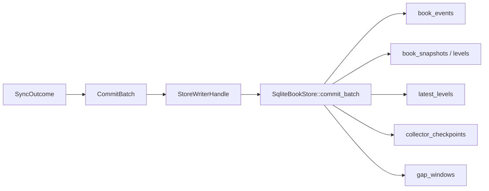
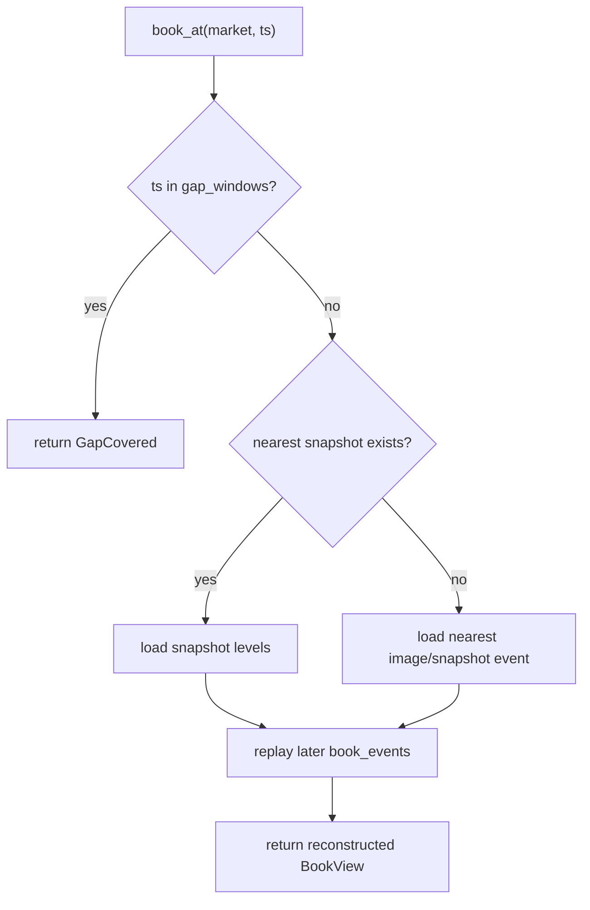

# 存储与查询说明

本文描述 SQLite schema、物化策略以及当前的 Rust 查询接口与 CLI。

## 存储结构

当前 SQLite schema 由 `src/storage.rs` 初始化，核心表如下：

### 元数据与运行状态

- `markets`
  - market 元数据缓存
- `collector_runs`
  - 采集器运行实例
- `stream_epochs`
  - 每个 market 的连续同步阶段

### 订单簿主数据

- `book_events`
  - 标准化事件日志
- `book_snapshots`
  - 快照元信息
- `book_snapshot_levels`
  - 快照档位明细
- `latest_levels`
  - 最新盘口物化表

### 完整性与恢复

- `collector_checkpoints`
  - 每个 market 的最新 checkpoint
- `gap_windows`
  - 不可补回或不可连续的缺口

## 只读视图

- `v_latest_best_quote`
- `v_market_health`
- `v_gap_summary`

## 写入策略



### 为什么同时保留事件和物化状态

只存 latest book 不够：

- 无法回放历史
- 无法审计 gap
- 无法做 `book_at`

只存事件也不够：

- 读取最新盘口会很慢
- 每次都要从头重放

因此当前采用“双层存储”：

- 事件日志用于审计和历史重建
- `latest_levels` 用于快速查询当前簿
- 快照用于降低历史回放成本

## 查询接口

`src/query.rs` 当前提供：

- `list_markets(venue)`
- `latest_book(market, depth)`
- `events(market, range, limit)`
- `snapshots(market, range, limit)`
- `gaps(market, range)`
- `collector_state(market)`
- `book_at(market, ts_ms, depth)`

## 查询 CLI

当前仓库还提供独立查询二进制：

- `cargo run --bin query -- ...`

支持的子命令：

- `markets`
- `latest`
- `book-at`
- `events`
- `snapshots`
- `gaps`
- `health`

所有子命令都支持：

- `--db <sqlite_path>`
- `--json`

示例：

```bash
cargo run --bin query -- --db tokenresearch.sqlite markets
```

```bash
cargo run --bin query -- \
  --db tokenresearch.sqlite \
  --json \
  latest \
  --venue lighter \
  --symbol PROVE \
  --depth 5
```

```bash
cargo run --bin query -- \
  --db tokenresearch.sqlite \
  health \
  --venue hyperliquid \
  --symbol BTC
```

## `book_at` 的语义

`book_at` 的实现逻辑：

1. 先检查请求时间是否命中 `gap_windows`
2. 如果命中 gap，直接返回 `GapCovered`
3. 如果有早于该时刻的 snapshot，则从最近 snapshot 重建
4. 否则从最近的 `image` / `snapshot` 事件作为锚点
5. 重放锚点之后直到目标时刻之前的事件



## 精度与数值存储

为了避免浮点误差：

- Rust 内部使用 `rust_decimal::Decimal`
- SQLite 中价格和数量按字符串写入

这可以保留不同交易所之间不同的价格和数量精度。

## 已知边界

- 当前没有自动历史归档策略
- 当前没有 SQL migration versioning 机制，schema 直接通过 `CREATE TABLE IF NOT EXISTS` 初始化
- 当前没有 HTTP 查询服务，查询主要通过 Rust API、CLI 和 SQLite 视图完成
