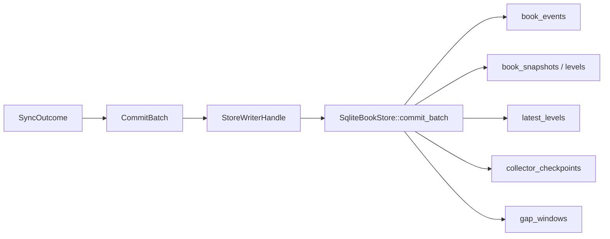
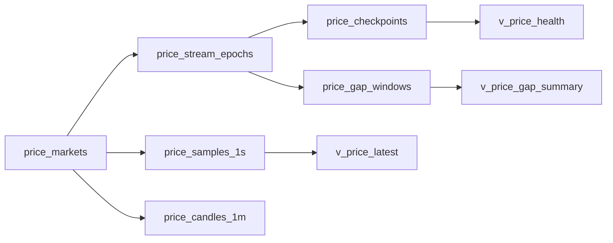
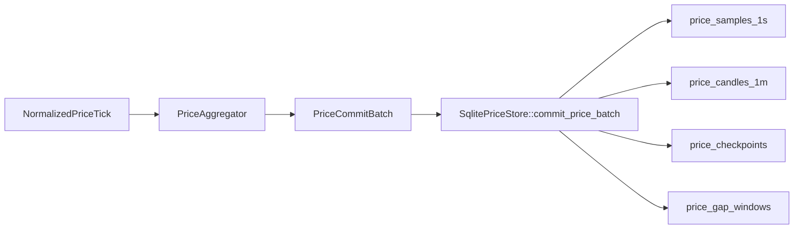
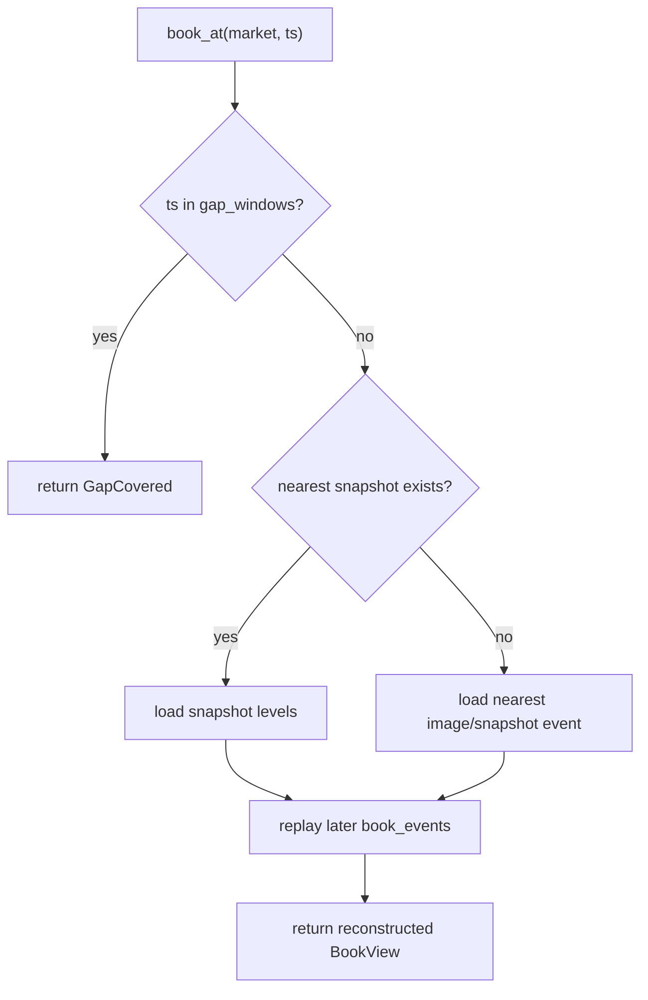

# 存储与查询说明

本文描述两套 SQLite schema、物化策略以及当前的 Rust 查询接口与 CLI。

## 订单簿存储结构

订单簿数据库 schema 由 `src/storage.rs` 初始化。

### 元数据与运行状态

- `markets`
- `collector_runs`
- `stream_epochs`

### 订单簿主数据

- `book_events`
- `book_snapshots`
- `book_snapshot_levels`
- `latest_levels`

### 完整性与恢复

- `collector_checkpoints`
- `gap_windows`

### 只读视图

- `v_latest_best_quote`
- `v_market_health`
- `v_gap_summary`

## 订单簿写入策略



### 为什么同时保留事件和物化状态

只存 latest book 不够：

- 无法回放历史
- 无法审计 gap
- 无法做 `book_at`

只存事件也不够：

- 读取最新盘口会很慢
- 每次都要从头重放

因此订单簿系统采用双层存储：

- 事件日志用于审计和历史重建
- `latest_levels` 用于快速查询当前簿
- 快照用于降低历史回放成本

## 价格存储结构

价格数据库 schema 由 `src/price_storage.rs` 初始化，默认文件是 `token_prices.sqlite`。



### 元数据与运行状态

- `price_markets`
- `price_runs`
- `price_stream_epochs`

### 价格主数据

- `price_samples_1s`
  - 最近 30 天的实时样本
- `price_candles_1m`
  - 长期保存的 1m OHLCV

### 完整性与恢复

- `price_checkpoints`
- `price_gap_windows`

### 价格视图

- `v_price_latest`
- `v_price_health`
- `v_price_gap_summary`

## 价格表字段说明

### `price_markets`

一行代表一个“可查询的价格市场”。

- `venue`
  - 交易所名，目前是 `binance`、`hyperliquid`、`lighter`
- `symbol`
  - 本系统内部统一使用的市场符号
  - Binance 例子：`BTCUSDT`
  - Hyperliquid / Lighter 例子：`BTC`
- `venue_market_id`
  - 交易所原生市场标识
  - Binance / Hyperliquid 通常和 `symbol` 一样
  - Lighter 通常是数字 market id，例如 `57`
- `token`
  - 这个市场对应的基础 token 名称，用于 token 级查询
- `quote_asset`
  - 计价资产，目前常见是 `USDT` 或 `USDC`
- `status`
  - 市场状态，当前写入 `active` / `inactive`
- `supports_trade_history`
  - `1` 表示官方接口支持该市场的 `trade` 历史回补
- `supports_reference_history`
  - `1` 表示官方接口支持该市场的 `reference` 历史回补
- `updated_at_ms`
  - 这条市场元数据最近一次被 discovery 或 live fallback 更新的本地时间，毫秒时间戳

### `price_runs`

一行代表一次 `pricecollector` 进程运行周期。

- `id`
  - 本次运行的自增 id
- `started_at_ms`
  - 本次运行开始时间
- `stopped_at_ms`
  - 预留的结束时间，目前大多数情况下为空
- `status`
  - 运行状态，目前初始化时写 `running`

### `price_stream_epochs`

一行代表某个市场、某个价格口径的一段连续采集时期。

- `id`
  - epoch 主键
- `run_id`
  - 所属 `price_runs.id`
- `venue`
  - 交易所
- `symbol`
  - 市场符号
- `price_kind`
  - 价格口径，当前是 `trade` 或 `reference`
- `epoch_seq`
  - 同一 market + kind 在一次运行里的第几段连续流
- `started_at_ms`
  - 该 epoch 开始时间
- `ended_at_ms`
  - 该 epoch 结束时间
- `reason`
  - 结束原因；异常中断、重连、gap 修复时用于审计

### `price_samples_1s`

一行代表一个 `1s` 桶聚合后的实时价格样本，用于近实时查询。

- `venue`
  - 交易所
- `symbol`
  - 市场符号
- `price_kind`
  - `trade` / `reference`
- `bucket_ts_ms`
  - 这个 `1s` 样本桶的起始毫秒时间
- `open_price`
  - 这一秒内第一笔价格
- `high_price`
  - 这一秒内最高价格
- `low_price`
  - 这一秒内最低价格
- `close_price`
  - 这一秒内最后一笔价格
- `sample_count`
  - 这一秒内聚合了多少个 live tick
- `first_exchange_ts_ms`
  - 这一秒内第一笔 tick 的交易所时间
- `last_exchange_ts_ms`
  - 这一秒内最后一笔 tick 的交易所时间
- `updated_at_ms`
  - 这条 `1s` 样本最近一次落库时间

### `price_candles_1m`

一行代表一根 `1m` OHLCV candle，是长期保存的历史层。

- `venue`
  - 交易所
- `symbol`
  - 市场符号
- `price_kind`
  - `trade` / `reference`
- `open_time_ms`
  - 这根 candle 的开盘时间
- `close_time_ms`
  - 这根 candle 的收盘时间
- `open_price`
  - 开盘价
- `high_price`
  - 最高价
- `low_price`
  - 最低价
- `close_price`
  - 收盘价
- `volume`
  - 成交量；对 `reference` 口径通常没有真实成交量，因此可能为 `0`
- `trade_count`
  - 该分钟内交易笔数；如果交易所没提供就为空
- `source`
  - candle 来源，当前常见是：
  - `live`：由 websocket tick 滚动聚合出来
  - `backfill`：由历史 REST API 回补写入
- `updated_at_ms`
  - 这根 candle 最近一次写入时间

### `price_checkpoints`

一行代表某个 market + kind 的最新恢复位置。

- `venue`
  - 交易所
- `symbol`
  - 市场符号
- `price_kind`
  - `trade` / `reference`
- `epoch_id`
  - 当前关联的 `price_stream_epochs.id`
- `last_live_bucket_ms`
  - 最近一个成功写入的 `1s` 样本桶时间
- `last_candle_open_ms`
  - 最近一个成功写入的 `1m` candle 开盘时间
- `last_backfill_open_ms`
  - 最近一个通过 backfill 成功写入的 `1m` candle 开盘时间
- `last_exchange_ts_ms`
  - 最近一条 live tick 的交易所时间
- `updated_at_ms`
  - checkpoint 最近更新时间
- `status`
  - 当前状态，常见值：
  - `live`
  - `backfilled`

### `price_gap_windows`

一行代表一段不可确认完整的数据缺口。

- `id`
  - gap 主键
- `venue`
  - 交易所
- `symbol`
  - 市场符号
- `price_kind`
  - `trade` / `reference`
- `resolution`
  - gap 所属粒度，当前常见是 `1m`
- `started_at_ms`
  - 缺口开始时间
- `ended_at_ms`
  - 缺口结束时间
- `reason`
  - 缺口原因，常见值：
  - `unsupported_history`
  - `history_request_unavailable`
  - `backfill_request_failed`
  - `backfill_parse_failed`

## 价格视图字段说明

### `v_price_latest`

从 `price_samples_1s` 中挑出每个 market + kind 最新一条样本。

- `venue`
- `symbol`
- `price_kind`
- `ts_ms`
  - 最新 `1s` 桶时间
- `open_price`
- `high_price`
- `low_price`
- `close_price`
- `updated_at_ms`

### `v_price_health`

把 `price_checkpoints` 和最近一次 gap 时间汇总到一起，方便看健康状态。

- `venue`
- `symbol`
- `price_kind`
- `status`
- `updated_at_ms`
- `last_live_bucket_ms`
- `last_candle_open_ms`
- `last_backfill_open_ms`
- `last_gap_at_ms`

### `v_price_gap_summary`

按 market + kind 汇总 gap。

- `venue`
- `symbol`
- `price_kind`
- `gap_count`
- `last_gap_at_ms`

## 价格写入策略



## 查询接口

### 订单簿查询

`src/query.rs` 提供：

- `list_markets(venue)`
- `latest_book(market, depth)`
- `events(market, range, limit)`
- `snapshots(market, range, limit)`
- `gaps(market, range)`
- `collector_state(market)`
- `book_at(market, ts_ms, depth)`

### 价格查询

`src/price_query.rs` 提供：

- `list_price_markets(venue)`
- `latest_price(token, kind, venue, market_symbol)`
- `price_range(request)`
- `price_gaps(token, venue, range)`
- `price_health(venue, market_symbol, kind)`

### 为什么价格查询可以不带 `venue`

价格查询 API 默认支持 token 级查询。

也就是说，当你只提供：

- `token`
- `kind`
- 时间范围 / resolution

查询层会先在 `price_markets` 里找到这个 token 对应的所有市场，然后返回：

- `latest_price`
  - 返回多个 `LatestPrice`
- `price_range`
  - 返回多个 `PriceSeries`

这里的“多个”不是做跨交易所聚合平均，而是“每个 venue / market 各自独立返回一条结果”。

这样设计的原因是：

- 同一个 token 在不同交易所的市场符号不一致
  - Binance 常见是 `BTCUSDT`
  - Hyperliquid / Lighter 常见是 `BTC`
- 用户很多时候先想看“BTC 在三家上的价格情况”，而不是先记住每家的原始 symbol

如果要限制到单一交易所，就传 `venue`。
如果要限制到单一原始市场，就同时传 `venue + market_symbol`。

## 查询 CLI

统一查询二进制：

- `cargo run --bin query -- ...`

### 订单簿子命令

- `markets`
- `latest`
- `book-at`
- `events`
- `snapshots`
- `gaps`
- `health`

### 价格子命令

- `price-markets`
- `price-latest`
- `price-range`
- `price-gaps`
- `price-health`

### 全局参数

- 订单簿库：`--db <sqlite_path>`，默认 `tokenresearch.sqlite`
- 价格库：`--price-db <sqlite_path>`，默认 `token_prices.sqlite`
- 输出 JSON：`--json`

## CLI 示例

`markets`，列出全部订单簿市场：

```bash
cargo run --bin query -- --db tokenresearch.sqlite markets
```

`latest`，查询最新盘口：

```bash
cargo run --bin query -- \
  --db tokenresearch.sqlite \
  --json \
  latest \
  --venue lighter \
  --symbol PROVE \
  --depth 5
```

`book-at`，查询某个时间点的盘口：

```bash
cargo run --bin query -- \
  --db tokenresearch.sqlite \
  book-at \
  --venue binance \
  --symbol BTCUSDT \
  --ts-ms 1710000000000 \
  --depth 10
```

`price-markets`，列出价格市场：

```bash
cargo run --bin query -- \
  --price-db token_prices.sqlite \
  price-markets
```

`price-latest`，查看最新价格：

```bash
cargo run --bin query -- \
  --price-db token_prices.sqlite \
  --json \
  price-latest \
  --token BTC \
  --kind trade
```

`price-range`，查询指定时间范围：

```bash
cargo run --bin query -- \
  --price-db token_prices.sqlite \
  --json \
  price-range \
  --token BTC \
  --kind trade \
  --start-ms 1767225600000 \
  --end-ms 1768435200000 \
  --resolution 1m
```

`price-gaps`，查询价格缺口：

```bash
cargo run --bin query -- \
  --price-db token_prices.sqlite \
  price-gaps \
  --token BTC
```

`price-health`，查询价格流健康状态：

```bash
cargo run --bin query -- \
  --price-db token_prices.sqlite \
  --json \
  price-health \
  --venue binance \
  --symbol BTCUSDT \
  --kind trade
```

## `book_at` 的语义

`book_at` 的实现逻辑：

1. 先检查请求时间是否命中 `gap_windows`
2. 如果命中 gap，直接返回 `GapCovered`
3. 如果有早于该时刻的 snapshot，则从最近 snapshot 重建
4. 否则从最近的 `image` / `snapshot` 事件作为锚点
5. 重放锚点之后直到目标时刻之前的事件



## `price_range` 的语义

- `resolution=auto`
  - 如果窗口完整落在 `1s` 保留期内，并且没有命中 `1s` gap，则返回 `1s`
  - 否则回退到 `1m`
- `resolution=1s`
  - 超出 `30d` 保留期或命中 gap，直接返回错误
- `token` 查询
  - 返回每个 venue 的独立 `PriceSeries`
- `venue + symbol` 查询
  - 返回单个市场的原始序列

## 精度与数值存储

为了避免浮点误差：

- Rust 内部使用 `rust_decimal::Decimal`
- SQLite 中价格、数量、OHLCV 都按字符串写入

## 已知边界

- 当前没有自动历史归档策略
- 当前没有 SQL migration versioning 机制，schema 直接通过 `CREATE TABLE IF NOT EXISTS` 初始化
- 当前没有 HTTP 查询服务，查询主要通过 Rust API、CLI 和 SQLite 视图完成
- 价格系统当前只保证 `trade` 历史 `1m` 回补为基线；`reference` 历史只在交易所官方支持时可回补
